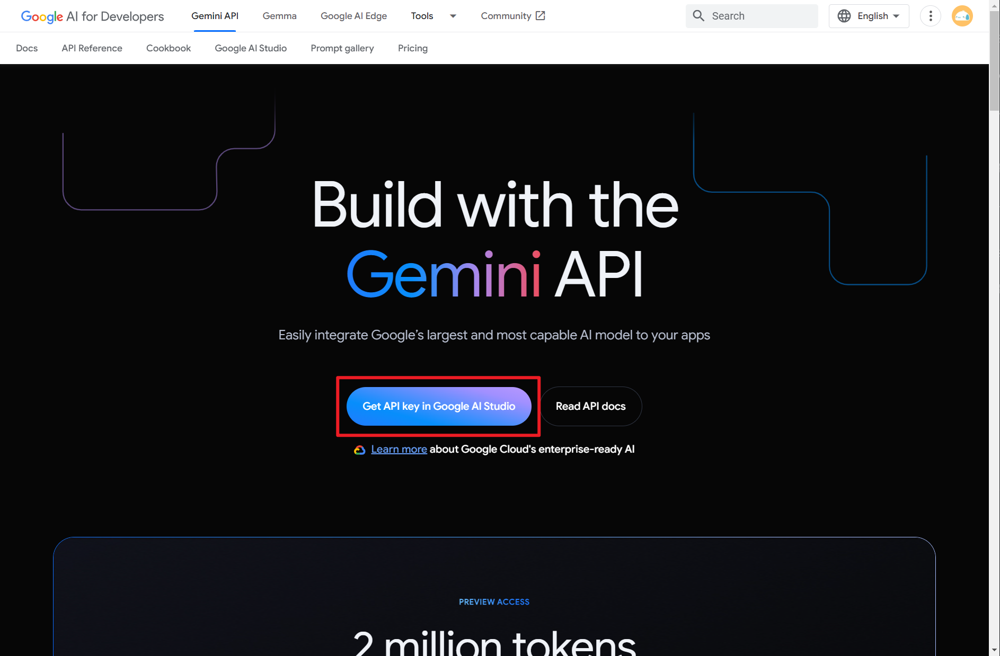
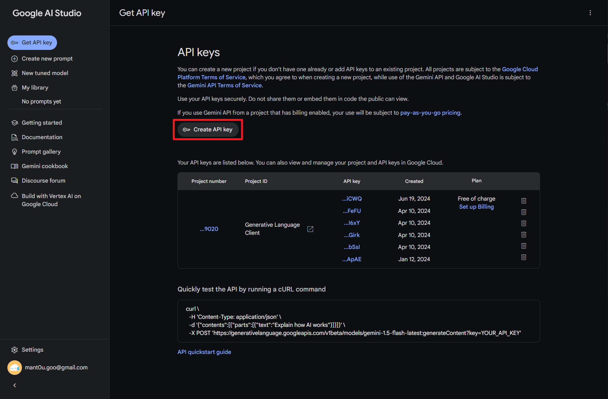
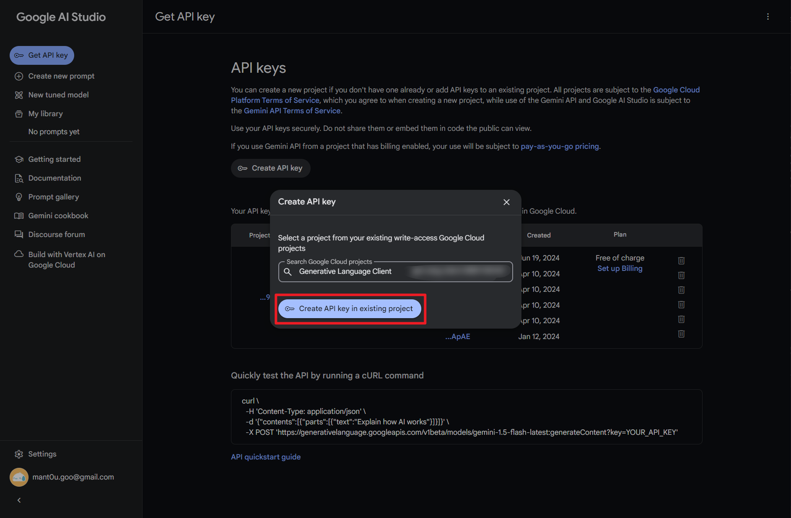
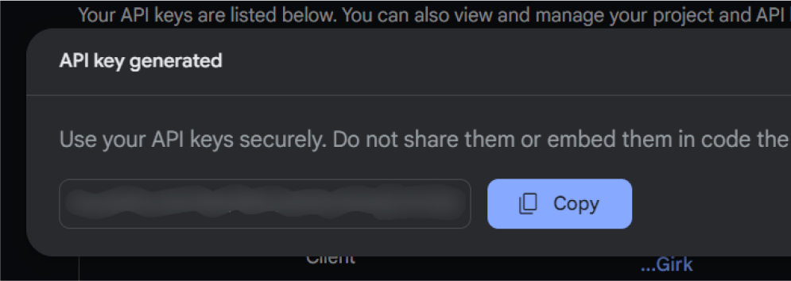
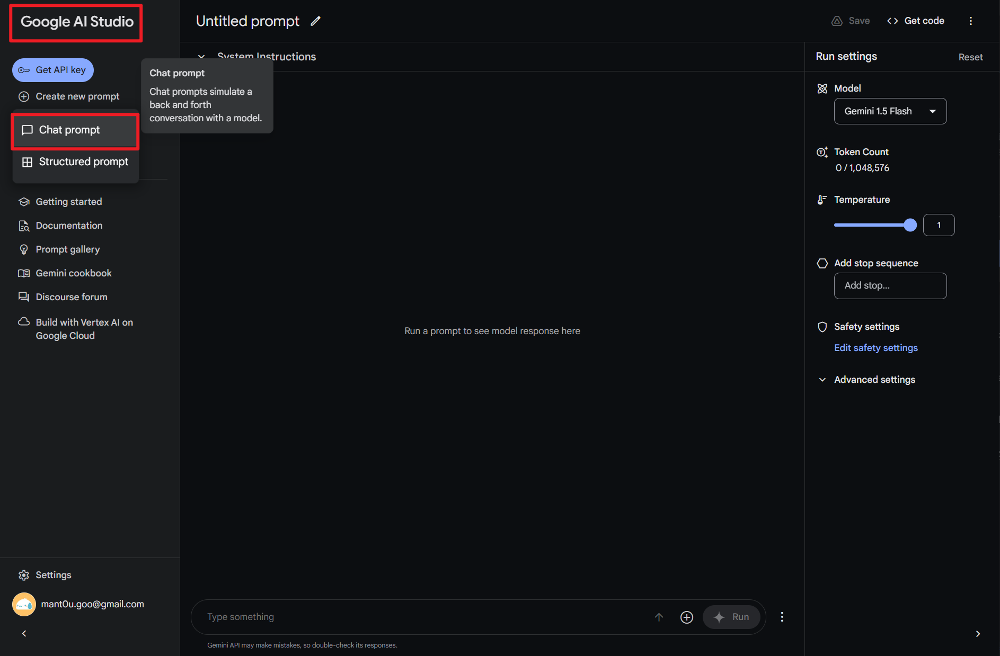
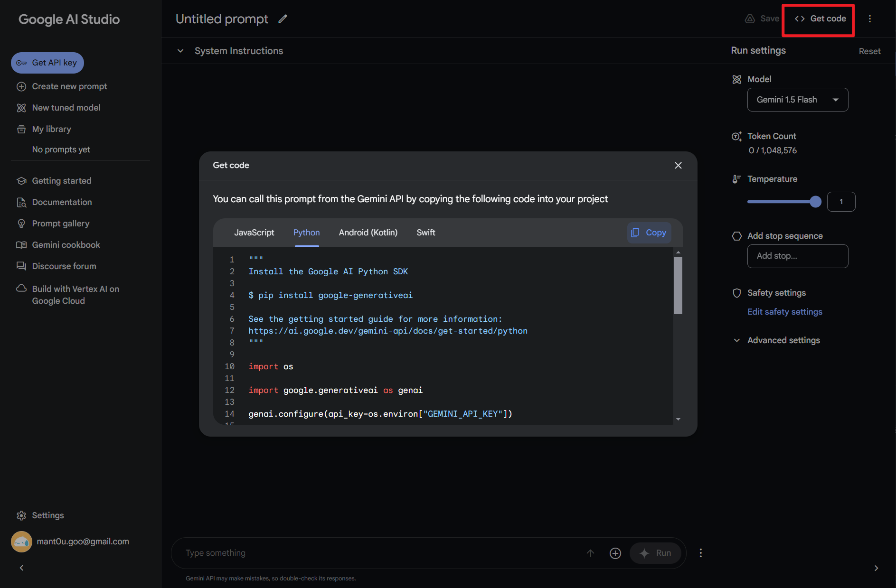
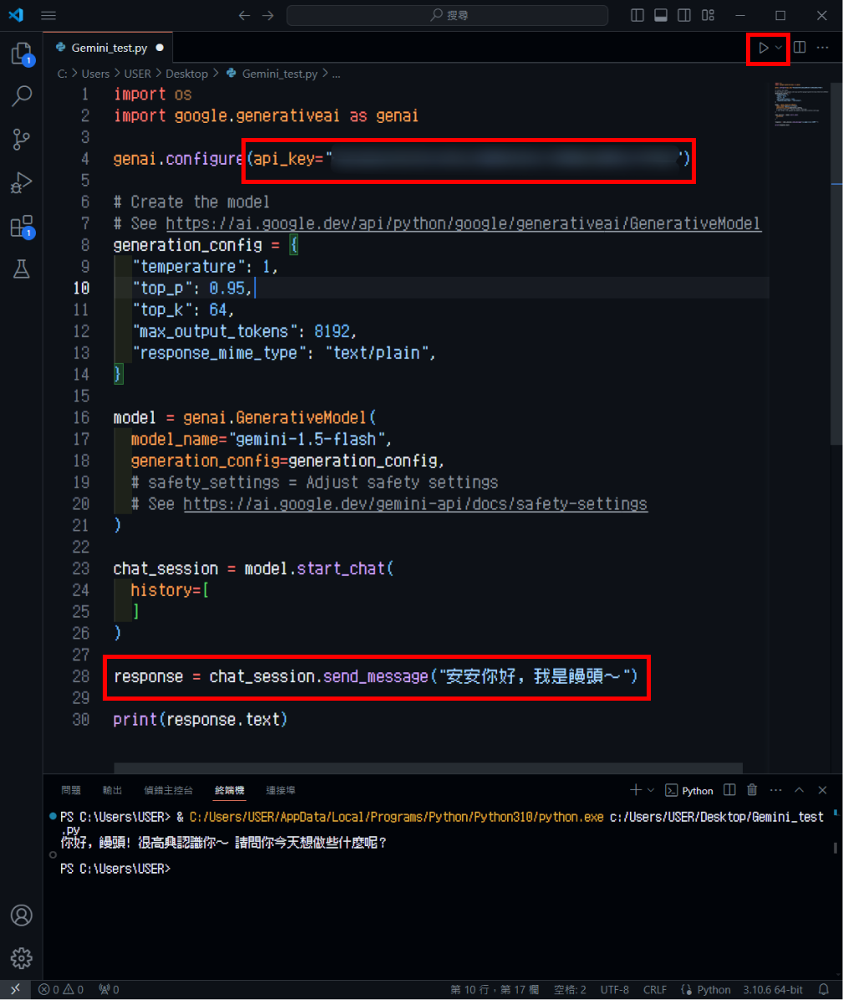

# 如何使用 Google Gemini API

1.  前往網站  
    Google AI for Developers ：https://ai.google.dev/gemini-api

    點選「獲取 API 金鑰」的按鈕，使用 Google 帳號登入。初次使用可能會需要一些帳號設定～

    

2.  建立新的金鑰  
    帳號登入後，會到「Get API keys」的頁面，點選「Create API key」按鈕，建立金鑰。
    

    初次建立時，會需要選一個 Google Cloud 專案，會有一個預設的可以選擇。
    

    選擇完成後，金鑰就會產生！（請保管好這組 KEY，不要讓別人知道，會被亂用）
    

3.  編輯 Prompt

    進入 Gemini Prompt 編輯介面，點左上角 LOGO 或 「Create new prompt」可以進到這個聊天畫面～

    

4.  取得程式碼

    點選右上角的「Get code」按鈕
    可以直接產生寫好的 Gemini API 程式碼，複製下來就可以用了。

    

5.  執行程式碼

    ## 方法一：使用 Google AI Python SDK

    以 Python 作為範例，請先確認電腦是否有安裝 [Python](https://www.python.org/) 環境，如果確認有安裝 Python 再往下繼續。

    初次執行時，需先安裝 Google AI Python SDK，於終端機輸入以下指令進行安裝。

    ```
    $ pip install google-generativeai
    ```

    接著，將剛剛的程式碼複製下來，開一個記事本存成「.py」檔，使用程式編輯器開啟。

    

    修改「指令」與「金鑰」後即可直接執行程式碼，就可以看到 Gemini 回傳的訊息了！

    

    ## 方法二：直接向網址發送 Post 請求

    如果不想使用 Google AI Python SDK，想直接發送請求給 Gemini
    也可以參考專案下的這個 [檔案](Example/requests-post.py)。

    不同的語言模型，有著不同的網址，依照自己的需求使用：

    - gemini-1.0-pro：https://generativelanguage.googleapis.com/v1/models/gemini-1.0-pro:generateContent?key={API_KEY}
    - gemini-1.5-flash：https://generativelanguage.googleapis.com/v1/models/gemini-1.5-flash:generateContent?key={API_KEY}
    - gemini-1.5-pro：https://generativelanguage.googleapis.com/v1/models/gemini-1.5-pro:generateContent?key={API_KEY}
    - gemini-1.0-pro (v1beta)：https://generativelanguage.googleapis.com/v1beta/models/gemini-1.0-pro:generateContent?key={API_KEY}
    - gemini-1.5-flash (v1beta)：https://generativelanguage.googleapis.com/v1beta/models/gemini-1.5-flash:generateContent?key={API_KEY}
    - gemini-1.5-pro (v1beta)：https://generativelanguage.googleapis.com/v1beta/models/gemini-1.5-pro:generateContent?key={API_KEY}
